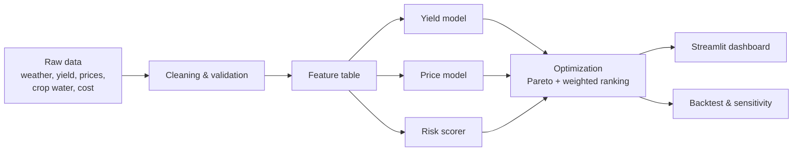

# 🌾 Water-Smart Crop Planner

A decision-support system that helps farmers and planners choose crops by balancing **profit**, **water use** and **climate risk**, using machine learning and multi-objective optimization.

**Study area:** Tiruvallur district, Tamil Nadu, India (13.14°N, 79.91°E) · **Period:** 2010–2023

> ⚠️ **Status: prototype running on synthetic data.** All datasets in this repository are currently generated by a script, so the numbers shown in the app are for testing the pipeline only. They are **not** real agricultural results. Real data can be swapped in through the config file (see [Using real data](#using-real-data)).

---

## Problem

Farmers in water-stressed regions often pick crops by habit or short-term market price, without a clear view of how much water each crop needs or how risky it is when rainfall is erratic. Most crop recommendation tools focus on soil nutrients and maximum yield and ignore water scarcity and risk. This leads to groundwater over-extraction, crop failure in dry years and unstable incomes.

## What this project does

Instead of returning one "best" crop, the planner scores every candidate crop on three objectives at once and shows the trade-offs:

| Objective | How it is measured |
|---|---|
| **Profit** | Predicted yield × predicted price − cost of cultivation |
| **Water** | Crop water requirement compared with rainfall plus irrigation available |
| **Climate risk** | Yield variability (coefficient of variation) and probability of yield failure in dry years |

The result is a **Pareto front** (crops that cannot be improved on one objective without getting worse on another) and a weighted ranking that follows the user's priorities (balanced, maximise profit, save water, play safe).

## Features

- Yield prediction (Random Forest vs XGBoost) with a time-aware train/test split
- Price prediction with P10 / P50 / P90 intervals (quantile regression)
- Climate-risk scoring per crop and season
- Multi-objective optimization and Pareto ranking
- Rainfall scenarios: Normal, Dry (−10%), Drought (−30%)
- Optional land allocator (split farm area across crops under a water budget)
- Backtesting and sensitivity analysis scripts
- Streamlit dashboard with Pareto chart, ranked table, water-savings view and plain-language explanation
- A visible **synthetic data** banner whenever any input is generated rather than real

## Architecture



## Project structure

```
water-smart-crop-planner/
├── app/                  # Streamlit dashboard (main.py, components/)
├── config/               # config.yaml: district, crops, use_synthetic flags
├── data/
│   ├── raw/              # input CSVs (synthetic by default)
│   └── processed/        # generated feature and risk tables
├── models/               # trained model files (generated)
├── outputs/              # metrics, backtest and sensitivity results (generated)
├── src/
│   ├── data/             # loaders, cleaning, synthetic generator, backtest
│   ├── models/           # yield and price models
│   ├── risk/             # risk scoring
│   └── optimization/     # Pareto / weighted ranking, land allocator
├── tests/                # unit tests
├── requirements.txt
└── README.md
```

## Getting started

### Requirements
- Python 3.11 or newer
- Git

### Installation

```bash
git clone https://github.com/<your-username>/water-smart-crop-planner.git
cd water-smart-crop-planner

# create and activate a virtual environment
python -m venv venv
venv\Scripts\activate          # Windows
source venv/bin/activate       # macOS / Linux

pip install -r requirements.txt
```

### Run the pipeline and the app

Run these from the project root, in order:

```bash
python src/data/generate_synthetic.py   # create synthetic input data
python src/data/build_features.py       # clean data and build the feature table
python src/models/yield_model.py        # train and compare yield models
python src/models/price_model.py        # train price quantile models
python src/risk/risk_scorer.py          # compute climate-risk scores
python src/data/backtest.py             # optional: backtest recommendations

python -m streamlit run app/main.py     # launch the dashboard
```

The dashboard opens at `http://localhost:8501`.

### Run the tests

```bash
python -m pytest
```

## Using real data

The project is designed so each dataset can be switched from synthetic to real independently. Put your CSV in `data/raw/` and set the matching flag to `false` in `config/config.yaml`:

```yaml
use_synthetic:
  weather: false      # e.g. NASA POWER daily data
  yield: false        # e.g. ICRISAT district-level data / data.gov.in
  prices: false       # e.g. Agmarknet mandi prices
  crop_water: false   # e.g. FAO crop water requirements
  cost: false         # e.g. TNAU cost of cultivation
```

| File | Suggested source |
|---|---|
| `weather.csv` | [NASA POWER](https://power.larc.nasa.gov/) (rainfall, temperature, humidity, wind, solar radiation) |
| `yield.csv` | ICRISAT District Level Database, [data.gov.in](https://data.gov.in/) |
| `prices.csv` | [Agmarknet](https://agmarknet.gov.in/) |
| `crop_water.csv` | FAO crop water requirement tables |
| `cost.csv` | Tamil Nadu Agricultural University crop production guides |

Describe the columns of each file in `data/raw/README.txt` so the loaders and future contributors know what each column means. The Kancheepuram merge option in the config exists because Tiruvallur's older records may sit under Kancheepuram, which was split in 2019.

## Methodology (summary)

1. **Data preparation:** cleaning, unit checks and validation per dataset; weather aggregated to year and season.
2. **Yield model:** Random Forest and XGBoost on seasonal rainfall, temperature and crop features, evaluated with a time-based split to avoid leakage.
3. **Price model:** quantile regression giving P10, P50 and P90 prices.
4. **Risk score:** normalised combination of yield variability and probability of failure in dry years.
5. **Optimization:** profit, water deficit and risk are combined into a Pareto front and a user-weighted score.
6. **Validation:** time-based backtesting against actual outcomes and sensitivity analysis on rainfall, price and weights.

## Limitations

- Current results use **synthetic data** and must not be used for farming decisions or reported as real findings.
- Crop water requirements and cultivation costs are approximate averages, not field measurements.
- Price forecasting is inherently uncertain; the P10-P90 range should be read as a scenario, not a promise.
- The backtest covers only a few recent years, which limits how strongly conclusions can be drawn.
- Rankings depend on the chosen weights and on how scores are normalised; very different crops (for example year-long sugarcane versus 70-day pulses) need careful comparison.

## Tech stack

Python · pandas · NumPy · scikit-learn · XGBoost · pymoo · Plotly · Streamlit · pytest

## Roadmap

- Replace synthetic data with real data for Tiruvallur
- Run the backtest over a longer window with real records
- Add more districts
- Tamil language interface
- Satellite-based (NDVI) crop stress indicators

## Author

Shreyashree Divakaran· https://github.com/shreyaadivakaran 
