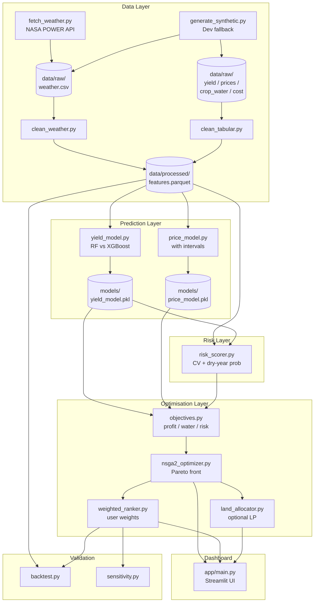

# Design — Water-Smart Crop Planner

> **Status:** Draft v1.0 — awaiting approval  
> **Date:** 2026-10-04  
> **Companion doc:** requirements.md

---

## 1. Architecture Overview

The system is a local Python application with five layers that execute in a
directed pipeline and surface results through a Streamlit dashboard.



---

## 2. Directory Structure

```
water-smart-crop-planner/
├── config/
│   └── config.yaml               # District, crops, paths, seeds, weights
├── data/
│   ├── raw/
│   │   ├── README.txt            # Column descriptions for all raw files
│   │   ├── weather.csv
│   │   ├── yield.csv
│   │   ├── prices.csv
│   │   ├── crop_water.csv
│   │   └── cost.csv
│   └── processed/
│       ├── features.parquet
│       └── risk_scores.parquet
├── models/
│   ├── yield_model.pkl
│   └── price_model.pkl
├── outputs/
│   └── plots/                    # PNG exports of every Plotly figure
├── logs/
│   └── data_validation.log
├── notebooks/
│   └── 01_eda.ipynb              # Exploratory data analysis
├── src/
│   ├── data/
│   │   ├── __init__.py
│   │   ├── fetch_weather.py      # NASA POWER downloader
│   │   ├── generate_synthetic.py # Synthetic data generator
│   │   ├── clean_weather.py      # Weather cleaner + feature engineering
│   │   ├── clean_tabular.py      # yield / prices / crop_water / cost cleaners
│   │   └── validate.py           # Missing value / unit / coverage checks
│   ├── models/
│   │   ├── __init__.py
│   │   ├── yield_model.py        # RF + XGBoost training & evaluation
│   │   └── price_model.py        # Price forecasting + intervals
│   ├── risk/
│   │   ├── __init__.py
│   │   └── risk_scorer.py        # CV, dry-year failure probability
│   ├── optimization/
│   │   ├── __init__.py
│   │   ├── objectives.py         # Objective function definitions
│   │   ├── nsga2_optimizer.py    # pymoo NSGA-II wrapper
│   │   ├── weighted_ranker.py    # Weighted-sum scorer
│   │   └── land_allocator.py     # Optional area-fraction LP
│   └── utils/
│       ├── __init__.py
│       ├── config_loader.py      # Reads config.yaml, validates keys
│       ├── logger.py             # Centralised logging setup
│       └── plotting.py           # Shared Plotly helpers + PNG export
├── app/
│   ├── main.py                   # Streamlit entry point
│   └── components/
│       ├── sidebar.py            # Input widgets
│       ├── pareto_chart.py       # Pareto scatter component
│       ├── ranked_table.py       # Results table component
│       └── explanation.py        # Plain-language card
├── tests/
│   ├── test_risk_scorer.py
│   ├── test_objectives.py
│   ├── test_nsga2_optimizer.py
│   └── test_data_pipeline.py
├── requirements.txt
├── requirements.md
├── design.md
├── tasks.md
└── README.md
```

---

## 3. Component Design

### 3.1 Configuration (`config/config.yaml`)

```yaml
district:
  name: Tiruvallur
  state: Tamil Nadu
  lat: 13.14
  lon: 79.91

study_period:
  start_year: 2010
  end_year: 2023

crops:
  candidates: [paddy, groundnut, sugarcane, black_gram, green_gram, maize, ragi]
  min_data_years: 8          # drop crop if fewer usable years; configurable

seasons:
  - kharif                   # Jun–Sep
  - rabi                     # Oct–Jan
  - summer                   # Feb–May

data:
  # Per-dataset synthetic flags — set any to false when real file is ready
  use_synthetic:
    weather:    true
    yield:      true
    prices:     true
    crop_water: true
    cost:       true
  raw_dir: data/raw
  processed_dir: data/processed
  weather_cache: data/raw/weather_cache.json   # local NASA POWER cache
  merge_kancheepuram: true   # merge Kancheepuram records for years ≤ 2019

models:
  random_seed: 42
  train_test_split_year: 2020
  yield:
    rf_n_estimators: 200
    xgb_n_estimators: 200
    xgb_learning_rate: 0.05
  price:
    forecast_horizon_months: 6
    quantiles: [0.10, 0.50, 0.90]   # P10 / P50 / P90

optimization:
  population_size: 100
  n_generations: 200
  random_seed: 42

risk:
  dry_year_rainfall_percentile: 30
  yield_failure_threshold_fraction: 0.70  # below 70 % of mean = failure

weights_default:
  profit: 0.5
  water: 0.3
  risk: 0.2
```

---

### 3.2 Data Layer

#### 3.2.1 Raw File Schemas

| File | Key Columns |
|------|-------------|
| `weather.csv` | `date`, `PRECTOTCORR` (mm/day), `T2M_MAX` (°C), `T2M_MIN` (°C), `RH2M` (%), `WS2M` (m/s), `ALLSKY_SFC_SW_DWN` (MJ/m²/day) |
| `yield.csv` | `year`, `season`, `crop`, `yield_kg_ha` |
| `prices.csv` | `year`, `month`, `crop`, `market`, `price_inr_quintal` |
| `crop_water.csv` | `crop`, `season`, `water_req_mm` |
| `cost.csv` | `year`, `crop`, `season`, `cost_inr_ha` |

#### 3.2.2 Feature Engineering (`clean_weather.py`)

From daily weather, compute per-season aggregates per year:
- `seasonal_rainfall_mm` — sum of `PRECTOTCORR`
- `mean_tmax`, `mean_tmin` — average of daily max/min
- `heat_stress_days` — count of days where T2M_MAX > 35 °C
- `dry_spell_days` — longest consecutive run of PRECTOTCORR < 1 mm

Merge with yield, price, and cost tables on `(year, crop, season)` to produce
`data/processed/features.parquet`.

#### 3.2.3 Synthetic Data Generator (`generate_synthetic.py`)

Generates statistically plausible data using fixed seed.
Each dataset is generated independently and respects its own `use_synthetic`
flag from config — only datasets with the flag set to `true` are generated.

- Weather: seasonal rainfall drawn from Normal(850, 150) mm for kharif,
  Normal(280, 80) for rabi; temperature from historical Tamil Nadu ranges.
- Yield: baseline per crop + noise + rainfall interaction term.
- Prices: random walk around crop-specific base price.
- crop_water and cost: fixed lookup tables from FAO-56 / TNAU defaults.

A header comment in every generated file reads:
`# SYNTHETIC DATA — generated by generate_synthetic.py — NOT real observations`

The dashboard reads `config.data.use_synthetic` at startup and shows a
sticky **"⚠ SYNTHETIC DATA"** banner naming the affected datasets whenever
any flag is `true`.

#### 3.2.4 Kancheepuram District Merge

When `config.data.merge_kancheepuram: true`, `clean_tabular.py` augments the
Tiruvallur yield series with Kancheepuram district rows for years ≤ 2019 (the
pre-split period when both districts shared administrative boundaries). Merged
rows receive a `source = "merged"` column. A `WARNING` is logged listing the
year range and row count added. This option exists solely to increase the
effective data length per crop toward the `min_data_years` threshold.

#### 3.3.1 Yield Model (`yield_model.py`)

```
Features:  seasonal_rainfall_mm, mean_tmax, mean_tmin,
           heat_stress_days, dry_spell_days,
           crop (OrdinalEncoder), year (int)
Target:    yield_kg_ha
Split:     train year ≤ config.train_test_split_year (e.g. 2020)
           test year > split year
Models:    RandomForestRegressor, XGBRegressor (fixed seed)
Metrics:   MAE, RMSE, R²  — logged and saved to outputs/model_metrics.csv
Artifacts: best model → models/yield_model.pkl
           actual-vs-predicted plot → outputs/plots/yield_actual_vs_pred.png
```

#### 3.3.2 Price Model (`price_model.py`)

- Aggregates monthly prices to seasonal averages per crop.
- Trains three separate `GradientBoostingRegressor(loss='quantile')` models
  for quantiles **P10, P50, P90** with year and crop features.
- Returns `(p10, p50, p90)` at inference time. The dashboard displays P50 as
  the point estimate and P10/P90 as the uncertainty band.
- When `use_synthetic.prices: true`, a note is embedded in model metadata and
  surfaced in the dashboard: *"Price intervals are derived from synthetic data
  and do not reflect real market conditions."*

---

### 3.4 Risk Layer (`risk_scorer.py`)

For each (crop, season):

```
CV = std(yield_kg_ha) / mean(yield_kg_ha)

dry_years = years where seasonal_rainfall_mm < percentile(rainfall, 30)
P_failure = count(yield < threshold * mean_yield in dry_years) / len(dry_years)

risk_score_raw = 0.5 * CV + 0.5 * P_failure
risk_score = MinMaxScaler().fit_transform(risk_score_raw)   # → [0, 1]
```

Saved to `data/processed/risk_scores.parquet`.

---

### 3.5 Optimisation Layer

#### 3.5.1 Objective Functions (`objectives.py`)

```
f1 (minimise −profit):
    profit = predicted_yield × predicted_price − cost_per_ha

f2 (minimise water_deficit):
    water_deficit = max(0, crop_water_req − (seasonal_rainfall + irrigation))

f3 (minimise risk_score):
    risk_score  (from risk layer, already in [0,1])
```

All three objectives are expressed as minimisation (profit is negated) for
compatibility with pymoo.

#### 3.5.2 NSGA-II (`nsga2_optimizer.py`)

- Decision variable: integer index into the list of candidate crops (discrete).
- Population size and generations from config.
- Returns `pymoo.core.result.Result`; Pareto front extracted as a DataFrame with
  columns `[crop, profit, water_deficit, risk_score]`.

#### 3.5.3 Weighted-Sum Ranker (`weighted_ranker.py`)

```
score = w_profit × (−profit_norm) + w_water × water_deficit_norm
        + w_risk × risk_score_norm
```

Each objective is normalised to [0, 1] across the Pareto set before weighting.
Returns a ranked DataFrame, lowest score = best.

#### 3.5.4 Land Allocator (`land_allocator.py`) — Optional

Solves:

```
maximise  sum_i( area_i × profit_i )
subject to:
    sum_i( area_i ) = total_acreage
    sum_i( area_i × water_req_i ) ≤ water_budget
    area_i ≥ 0
```

Uses `scipy.optimize.linprog` (no external LP solver needed).

---

### 3.6 Streamlit Dashboard (`app/main.py`)

#### Layout

```
┌─────────────────────────────────────────────────┐
│  Sidebar                │  Main Panel            │
│  ─────────────────────  │  ──────────────────────│
│  Season selector        │  Tab 1: Pareto Chart   │
│  Irrigation (mm)        │  Tab 2: Ranked Table   │
│  Rainfall scenario      │  Tab 3: Water Savings  │
│  Weight sliders ×3      │  Tab 4: Backtest       │
│  [Run Analysis] button  │  Explanation Card      │
│                         │  Disclaimer Banner     │
└─────────────────────────────────────────────────┘
```

#### Component Responsibilities

| Component | File | Responsibility |
|-----------|------|----------------|
| Sidebar | `app/components/sidebar.py` | Collect user inputs, validate weight sum |
| Pareto Chart | `app/components/pareto_chart.py` | Plotly scatter, bubble = risk, hover = crop details |
| Ranked Table | `app/components/ranked_table.py` | Styled DataFrame, highlight top row |
| Explanation | `app/components/explanation.py` | Generate plain-language text for top crop |

#### Session State Flow

```
User inputs → sidebar.py → st.session_state["params"]
                         ↓
             Run Analysis → run_pipeline(params)
                         ↓
             Store results in st.session_state["results"]
                         ↓
             Components render from session_state["results"]
```

---

### 3.7 Validation Layer

#### Backtest (`src/data/backtest.py`)

- For each test year, run the full optimisation using only data up to that year
  (walk-forward).
- Compare top recommendation to actual crop-mix record (from yield.csv, dominant
  crop by area or yield).
- Report: hit rate (%), mean profit delta (₹/ha), mean water delta (mm).

#### Sensitivity Analysis (`src/data/sensitivity.py`)

- Grid: rainfall ∈ {−30 %, −10 %, 0, +10 %}, price ∈ {−20 %, 0, +20 %},
  weight sets ∈ {profit-heavy, balanced, risk-averse}.
- For each combination, run weighted ranker and record rank of each crop.
- Output: heatmap of rank stability → `outputs/plots/sensitivity_heatmap.png`.

---

## 4. Data Flow Diagram

```
config.yaml
    │
    ▼
[Data Pipeline] ──────────────────────────────────────────────┐
fetch_weather.py / generate_synthetic.py                       │
    → data/raw/*.csv                                           │
    → clean_weather.py + clean_tabular.py                      │
    → validate.py  (logs warnings)                             │
    → data/processed/features.parquet                          │
                                                               │
[Prediction Layer]                                             │
features.parquet → yield_model.py  → models/yield_model.pkl   │
features.parquet → price_model.py  → models/price_model.pkl   │
                                                               │
[Risk Layer]                                                   │
features.parquet + yield_model.pkl → risk_scorer.py            │
    → data/processed/risk_scores.parquet                       │
                                                               │
[Optimisation Layer]                                           │
yield_model.pkl + price_model.pkl + risk_scores.parquet        │
    → objectives.py                                            │
    → nsga2_optimizer.py → Pareto front DataFrame              │
    → weighted_ranker.py → ranked DataFrame                    │
    → land_allocator.py  → allocation DataFrame (optional)     │
                                                               │
[Dashboard]  ◄─────────────────────────────────────────────────┘
app/main.py → sidebar inputs → run_pipeline()
    → pareto_chart, ranked_table, explanation
    → st.session_state display
```

---

## 5. Key Design Decisions

| Decision | Rationale |
|----------|-----------|
| Synthetic-first development | Allows full pipeline testing before real data is sourced; swap is a single config flag |
| Time-aware train/test split | Prevents leakage; mirrors real-world forecasting scenario |
| Discrete NSGA-II over crops | Crop choice is inherently categorical; continuous relaxation is not meaningful |
| pymoo for NSGA-II | Actively maintained, clean multi-objective API, MIT licence |
| `scipy.linprog` for land allocation | Zero additional dependency; adequate for ≤ 10 crops |
| Quantile regression for price intervals | Avoids distributional assumptions; gives asymmetric intervals |
| Parquet for processed data | Fast I/O, type-preserving, smaller than CSV for wide feature tables |
| All plots saved as PNG | Ensures outputs exist even when running headless / in CI |

---

## 6. Testing Strategy

| Test File | Coverage |
|-----------|----------|
| `tests/test_risk_scorer.py` | CV calculation, dry-year probability, edge case (zero variance) |
| `tests/test_objectives.py` | Profit calculation with known inputs, water deficit clipping at 0 |
| `tests/test_nsga2_optimizer.py` | Pareto front is non-dominated, result shape, seed reproducibility |
| `tests/test_data_pipeline.py` | Synthetic generator schema, validation warning triggers, feature shape |

Run with: `pytest tests/ -v --tb=short`

---

## 7. Dependency List (requirements.txt preview)

```
pandas==2.2.2
numpy==1.26.4
scikit-learn==1.5.1
xgboost==2.1.1
pymoo==0.6.1.3
plotly==5.22.0
streamlit==1.36.0
scipy==1.13.1
pyarrow==16.1.0
requests==2.32.3
pyyaml==6.0.2
pytest==8.2.2
```

Exact versions pinned for reproducibility. All packages are free and open-source.
NASA POWER fetch requires internet access; all other steps are fully offline.
